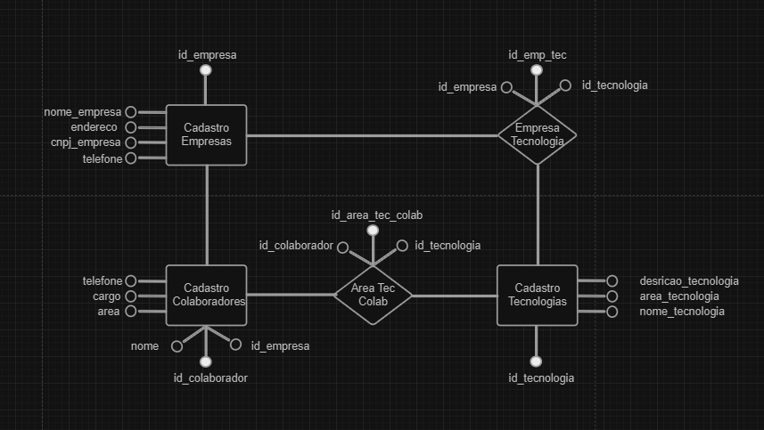
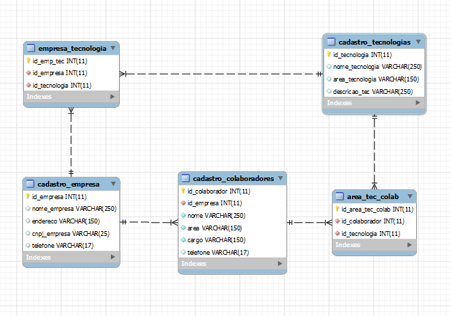

# RESILIADATA - Sistema de Gerenciamento de Dados Empresariais

Este repositório contém o código fonte e scripts para criar e alimentar um banco de dados fictício chamado RESILIADATA, desenvolvido como parte do projeto individual do Módulo 3 do curso de Análise de Dados.

## Estrutura do Projeto

- **scripts/:**
  - **database_scripts/:** Contém scripts SQL para criar o banco de dados e tabelas.
  - **data_generation_scripts/:** Script Python para gerar dados fictícios.
  - **files/:** Armazena dados utilizados pelo sistema.
    - **tecnologias.json:** JSON com informações sobre as tecnologias utilizadas.
    - **cargos.json:** JSON com informações sobre cargos e funções.
- **data/:** Pasta para arquivos CSV gerados pelo script de geração de dados.
- **modelos/:** Contém modelos conceitual e lógico do banco de dados.
- **requirements.txt:** Lista de requisitos do projeto.
- **README.md:** Este arquivo, fornecendo informações gerais sobre o projeto e instruções de uso.

## Como Usar

### Configuração do Banco de Dados:

1. Execute no [MySQL Workbench](https://www.mysql.com/products/workbench/) o script `create_database` em `scripts/database_scripts/` para criar o banco de dados e as tabelas necessárias.

### Gerar Dados Fictícios com o Código Python:

1. Abra o terminal na pasta do projeto.
2. Execute o script Python `generate_data.py` localizado em `scripts/data_generation_scripts/`.
3. Siga as instruções para inserir a quantidade desejada de dados para empresas, colaboradores e tecnologias.
4. Forneça um prefixo para os nomes dos arquivos CSV gerados.

Os arquivos CSV serão salvos na pasta `data/` com os nomes `<prefixo>_empresas.csv`, `<prefixo>_colaboradores.csv` e `<prefixo>_tecnologias.csv`.

### Povoar o Banco de Dados:

1. Utilize no [MySQL Workbench](https://www.mysql.com/products/workbench/) o script `load_data` em `scripts/database_scripts/` para inserir os dados no banco de dados.

## Modelo Conceitual e Lógico do Banco de Dados

Veja abaixo os modelos conceitual e lógico que representam a estrutura do banco de dados.

- **Modelo Conceitual**
  
- **Modelo Lógico**
  

## Dados de Exemplo

### Empresas:

Consulte `data/data_empresas.csv`.

### Colaboradores:

Consulte `data/data_colaboradores.csv`.

### Tecnologias:

Consulte `data/data_tecnologias.csv`.

## Dados Auxiliares

### Tecnologias:

Consulte `scripts/files/tecnologias.json` para obter informações sobre as tecnologias.

### Cargos e Funções:

Consulte `scripts/files/cargos.json` para obter informações sobre os cargos e funções.

## Programas Utilizados

- [MySQL Workbench 8.0 CE](https://www.mysql.com/products/workbench/)
- [XAMPP](https://www.apachefriends.org/index.html)
- [Python 3.12](https://www.python.org/downloads/release/python-312/)

## Requisitos do Projeto

Os requisitos necessários para o projeto estão listados no arquivo `requirements.txt`.

## Respostas aos Requisitos do Projeto

Consulte o arquivo `respostas.md` para obter respostas às perguntas e requisitos específicos do projeto.
